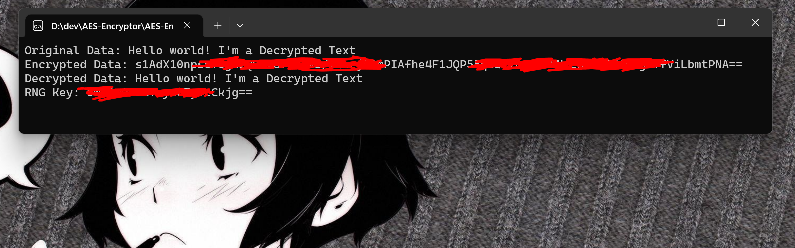

# AES Encryption Project

<div align="center">
  


</div>

This is a simple AES Encryption Console Project written in C#. It allows you to encrypt and decrypt sensitive data using the Advanced Encryption Standard (AES) algorithm.

<br/>

## Table of Contents

- [Introduction](#introduction)
- [Features](#features)
- [Getting Started](#getting-started)
  - [Prerequisites](#prerequisites)
  - [Installation](#installation)
- [How to Use](#how-to-use)
  - [Encrypting Data](#encrypting-data)
  - [Decrypting Data](#decrypting-data)
- [Tutorials](#tutorials)
  - [Saving Encryption Details](#saving-encryption-details)
  - [Viewing Encryption Details](#viewing-encryption-details)
  - [Example Entry in keys](#example-entry-in-keys)
- [Contributing](#contributing)
- [License](#license)
- [Change Log](#change-log)

<br/>

## Introduction

This AES Encryption Console Project is designed to provide a simple and secure way to encrypt and decrypt sensitive data in C#. The Advanced Encryption Standard (AES) algorithm is widely used and provides a high level of security for data protection.



<br/>

## Features

- Encrypt sensitive data using AES algorithm
- Decrypt previously encrypted data
- Secure generation and management of encryption keys
- User-friendly interface with options to encrypt and decrypt data

<br/>

## Getting Started

### Prerequisites
- [.NET SDK](https://dotnet.microsoft.com/download)
- [Git](https://git-scm.com/downloads)

### Installation
1. Clone the repository:

   ```bash
   git clone https://github.com/KR0N-SECURITY/AES-Encryptor.git

2. After this, go to the destination folder:

   ```bash
   cd AES-Encrypton
   
<br/>

## How to Use

### Encrypting Data

To encrypt data, follow these steps:

1. Open a terminal or command prompt.
2. Navigate to the project directory.
3. Run the encryption command:

   ```bash
   dotnet run --project AES-Encryptor -- --encrypt

4. Enter the data you want to encrypt when prompted.
5. The encrypted data and the encryption key will be displayed.

### Decrypting Data

To decrypt data, follow these steps:

1. Open a terminal or command prompt.
2. Navigate to the project directory.
3. Run the decryption command:

   ```bash
   dotnet run --project AES-Encryptor -- --decrypt

4. Enter the encrypted data and encryption key when prompted.
5. The decrypted data will be displayed.

<br/>

## Tutorials

### Saving Encryption Details
After encrypting or decrypting data, the program saves the encryption details to a text file named `keys.txt`. If the file already exists, it appends the new details to the existing file. Each entry in the file includes the following information:
- Method Used: Whether encryption or decryption was performed
- Computer Name: The name of the computer where the operation was performed
- Original Text: The text that was encrypted or decrypted
- Encrypted Data: The encrypted data (only for encryption)
- Key: The encryption key used
- IV: The initialization vector used
- Date of Operation: The date and time when the operation was performed

### Viewing Encryption Details
To view the encryption details saved in the `keys.txt` file, you can open the file using any text editor. Each entry is separated by two blank lines for better readability.

### Example Entry in keys
  ```bash
  Method Used: Encryption
  Computer Name: MyComputer
  Original Text: Hello, world!
  Encrypted Data: 9w2tR/Kazf1FYfNd7C6qGw==
  Key: p2/BZP4vahJ3SAljRQbM9Q==
  IV: ZOa+HcSHnE3pZzR7c+oX5A==
  Date of Operation: 2024-03-01 15:30:45

  Method Used: Decryption
  Computer Name: MyComputer
  Original Text: Hello, world!
  Key: p2/BZP4vahJ3SAljRQbM9Q==
  IV: ZOa+HcSHnE3pZzR7c+oX5A==
  Date of Operation: 2024-03-01 15:32:10
  ```

<br/>

## Contributing

Contributions are welcome! If you find any issues or have ideas for improvements, please open an issue or submit a pull request.

## License

This project is licensed under the [MIT License](LICENSE). Feel free to use, modify, and distribute the code as permitted by the terms of the MIT License.

## Change Log

- **[2024-03-01]**: Implemented user input options for encrypting and decrypting data, added logging functionality to save encryption details to a text file, and updated README.md with the latest changes.
